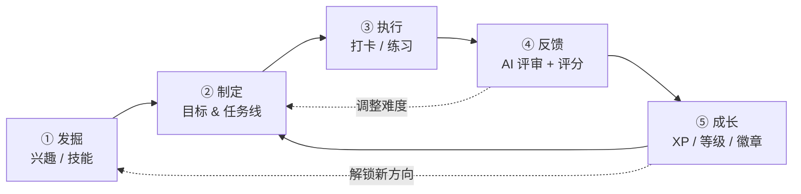
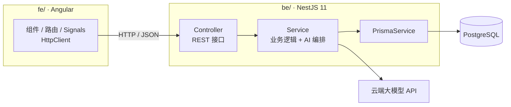
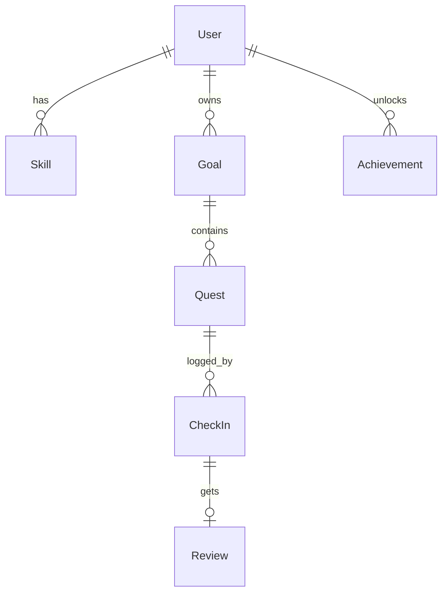

# InnerUp 项目规划

> 一个以 AI 为教练、把「自我提升」游戏化的成长系统。

---

## 1. 一句话定位

**InnerUp 把「我想变得更好」变成一款可玩的 RPG：AI 帮你发现兴趣、把它拆成任务线，你完成任务获得经验与升级，AI 再根据你的表现调整下一步。**

关键词：`AI 教练` · `任务化` · `游戏化反馈` · `兴趣发掘`

---

## 2. 核心理念：一个闭环

用户不是来「管理待办」的，而是来「打怪升级」的。产品的核心是一条不断自我强化的循环：



**每个环节的价值：**

| 环节 | 用户痛点 | InnerUp 的解法 |
| --- | --- | --- |
| 发掘 | 「我不知道自己适合/喜欢什么」 | AI 对话式引导 + 兴趣测评，产出候选技能 |
| 制定 | 「知道了但不知道从哪开始」 | AI 把大目标拆成可执行的小任务 |
| 执行 | 「坚持不下去」 | 每日任务 + 连续打卡 streak + 番茄计时 |
| 反馈 | 「做了也不知道对不对」 | AI 点评、打分、追问、给下一步建议 |
| 成长 | 「感受不到进步」 | 经验值 / 等级 / 技能雷达图 / 复盘报告 |

> 设计原则：**任何一个环节都不能让用户面对空白的输入框。** AI 永远给出「下一步的建议」。

---

## 3. 产品细化：模块拆解

### 3.1 角色面板（Character Sheet）
用户的「游戏角色卡」。

- 等级 / 总经验值 / 距下一级进度条
- **技能雷达图**：如「编程、写作、体能、沟通、创造力」各自的等级
- 当前连续天数（streak）、累计投入时长
- 已解锁徽章

### 3.2 兴趣与技能发掘（Discovery）
- AI 引导问答：从「你最近一次忘记时间是什么时候？」这类问题切入
- 轻量测评：MBTI / 霍兰德只是引子，重点是 AI 的追问
- 输出：**3~5 个候选技能/兴趣**，用户勾选想深入的
- 可生成「试水任务」（低成本体验，如「花 30 分钟读一篇关于 XX 的文章」）

### 3.3 任务线（Quest Line = Goal + Quests）

两层结构：

```
任务线 Goal（例：学会弹吉他）
 ├─ 任务 Quest 1：认识持琴姿势与和弦图（30 min，+10 XP）
 ├─ 任务 Quest 2：练熟 C / G / Am 三个和弦（每天 15 min，+20 XP）
 ├─ 任务 Quest 3：完整弹唱一首简单歌（+50 XP）
 └─ ...
```

- 任务属性：标题、说明、难度（1~5）、预计时长、经验值奖励、验收标准、类型（主线/日常/挑战）
- AI 负责生成初版任务线，用户可拖拽增删改
- **动态调整**：连续完成 → 提升难度；多次卡住 → 拆得更细

### 3.4 执行与打卡（Execution）
- 打卡内容：文字总结、投入时长、证据（图片 / 链接 / 文件）
- 番茄钟计时器（可选，用于记录专注时长）
- 连续打卡 streak、日历热力图（GitHub 风格）

### 3.5 AI 教练评审（Coach Review）
- 用户提交完成内容 → AI 输出：`评分`、`做得好的地方`、`改进建议`、`下一个任务建议`
- 语气：鼓励式教练，不说教
- 以结构化数据返回（便于展示与入库），并支持流式输出提升体验

### 3.6 复盘与洞察（Insights）
- 周报 / 月报：AI 总结投入时间分布、进步轨迹、兴趣演化
- 「你这两周在『写作』上投入最多，要不要把它升级为主线？」

---

## 4. MVP 范围

> 原则：**只做一个能跑通的闭环，砍掉一切「以后可能有用」的功能。**

### ✅ MVP 只做这 6 件事

1. **创建 1 个目标**（输入「我想提升 XX」）
2. **AI 生成一条任务线**（3~7 个任务）
3. **任务列表 + 打卡**
4. **获得 XP → 升级**（简单的等级公式）
5. **连续打卡 streak**
6. **AI 对打卡内容给一次反馈**

### ❌ MVP 明确不做

- 多用户 / 社交 / 排行榜 / 好友
- 复杂测评题库
- 技能树可视化、成就徽章系统
- 移动 App、推送通知
- 付费、社区、分享海报
- 精致的动画与主题系统

> 目标：**一个周末就能跑起来**。第一版丑一点、糙一点没关系。

### 🧪 上线前先「手动跑一遍」（强烈建议）

在写任何代码之前，用 **ChatGPT + 飞书/Notion 表格**手动当一周的「AI 教练」：

1. 每天让 AI 给你出 2 个任务
2. 完成后把总结发回给 AI，让它点评
3. 自己在一张表里记 XP 和连续天数

一周后你会知道：**哪一步最爽、哪一步最烦、哪个功能其实根本不需要。** 这一周的手动流程就是产品的需求文档。

---

## 5. 技术方案

采用**前后端分离**架构：`fe/` = Angular 前端，`be/` = NestJS 11 后端，两者通过 REST API 通信（接口见第 6 节）。

### 5.1 前端（fe/）— Angular

| 层 | 选型 | 说明 |
| --- | --- | --- |
| 框架 | **Angular 20+**（standalone 组件 + Signals） | 官方全家桶，工程化最强，TS 原生 |
| 构建 | **Angular CLI + esbuild** | 内置构建，无需额外配置 |
| 语言 | **TypeScript** | Angular 本身即 TS 优先 |
| 路由 | **Angular Router**（`provideRouter`，懒加载） | 按 feature 懒加载 |
| 状态管理 | **Signals + 服务**（复杂后再上 NgRx SignalStore） | MVP 用 Signals 足够 |
| 请求 | **HttpClient**（`provideHttpClient` + `HttpInterceptorFn`） | 统一 baseURL、loading、错误处理 |
| UI | **Angular Material**（备选 PrimeNG / NG-ZORRO） | 官方组件库，稳定、无障碍完善 |
| 样式 | **SCSS +（可选）Tailwind CSS** | 主题与布局 |
| 图表 | **ngx-echarts** | 技能雷达图、打卡热力图 |
| 表单 | **Reactive Forms** | 与后端 DTO 对齐校验 |

> ⚠️ 注意：**AngularJS（1.x）已于 2022-01 停止维护**。本项目使用**现代 Angular（2+，当前最新为 20+）**，二者 API 完全不兼容。

### 5.2 后端（be/）— NestJS 11

| 层 | 选型 | 说明 |
| --- | --- | --- |
| 框架 | **NestJS 11** | 模块化 + 依赖注入 + 装饰器，工程化强 |
| 语言 | **TypeScript** | 与前端共享类型 |
| 数据库 | **PostgreSQL**（开发 / 生产统一，远端托管：Neon / Supabase / Railway） | 关系型，适合任务树结构；开发期直连远端库，无需本地安装 |
| ORM | **Prisma** | schema 即文档，与 NestJS 集成成熟 |
| DTO 校验 | **class-validator / class-transformer** | 配合全局 `ValidationPipe` |
| AI | **云端大模型 API**（官方 SDK，如 `openai`） | 结构化输出 + SSE 流式返回 |
| AI 结构化 | **Zod** | 约束模型输出，失败可重试 / 降级 |
| 接口文档 | **@nestjs/swagger** | 自动生成 Swagger，前后端联调必备 |
| 认证 | MVP 阶段可**免登录单用户**；需要时再上 `@nestjs/passport` + JWT | 自用阶段别浪费时间 |
| 部署 | 前端静态托管（Nginx / Netlify）+ 后端 Node 进程（Railway / Render / PM2） | 前后端独立部署 |

### 5.3 架构示意



### 5.4 仓库结构

`be/` 与 `fe/` 两个目录**正好对应前后端分离**，保留即可。推荐用 **npm / pnpm workspace** 组织成 monorepo：

- 根目录放 `package.json`（含 `workspaces` 字段）或 `pnpm-workspace.yaml`
- 好处：一条命令同时启动前后端；公共类型可抽到共享包；依赖互相隔离
- 若嫌麻烦，也可以两个独立项目各自 `npm install`，只是需要开两个终端分别启动

**子项目说明文档：** [`fe/README.md`](../fe/README.md)（Angular 前端）与 [`be/README.md`](../be/README.md)（NestJS 后端）。

> 说明：前后端分离相比全栈框架多了一层网络请求与联调成本，但边界清晰、前后端可独立部署，更适合你已有的目录结构，也便于后续单独扩展后端。

---

## 6. API 设计（REST）

统一前缀 `/api`，前端通过 Angular `HttpClient` 调用；后端由 NestJS Controller 暴露，Swagger 自动生成文档。

| 方法 | 路径 | 说明 |
| --- | --- | --- |
| `GET` | `/api/profile` | 角色面板：等级、XP、技能、streak |
| `GET` | `/api/goals` | 目标（任务线）列表 |
| `POST` | `/api/goals` | 创建目标 |
| `GET` | `/api/goals/:id` | 目标详情（含任务） |
| `PATCH` | `/api/goals/:id` | 更新目标（标题 / 状态） |
| `DELETE` | `/api/goals/:id` | 删除目标 |
| `POST` | `/api/goals/:id/generate` | **AI 生成任务线**（核心接口） |
| `GET` | `/api/quests` | 任务列表（支持 `?date=today`） |
| `POST` | `/api/quests` | 手动创建任务 |
| `PATCH` | `/api/quests/:id` | 更新任务（状态 / 排序） |
| `POST` | `/api/quests/:id/checkin` | **打卡**，返回获得的 XP 与 AI 反馈 |
| `GET` | `/api/insights/weekly` | **AI 周报**（SSE 流式可选） |
| `POST` | `/api/discovery/chat` | 兴趣发掘对话（后续迭代） |

**约定：**

- 统一响应体：`{ code, data, message }`
- 全局 `ValidationPipe`（`whitelist: true`）校验 DTO；全局异常过滤器统一错误格式
- AI 接口耗时较长：生成任务线走普通请求；评审 / 复盘用 **SSE**（NestJS `@Sse()` 装饰器）流式返回
- 前端用 `HttpInterceptorFn` 统一处理 baseURL（开发期配合 `proxy.conf.json` 代理）、错误提示与 loading 状态

---

## 7. 数据模型（Prisma 草案）



```prisma
model User {
  id           String   @id @default(cuid())
  email        String?  @unique
  name         String?
  level        Int      @default(1)
  xp           Int      @default(0)
  createdAt    DateTime @default(now())

  skills       Skill[]
  goals        Goal[]
  checkIns     CheckIn[]
  achievements Achievement[]
}

model Skill {            // 能力/兴趣，用于雷达图
  id      String @id @default(cuid())
  userId  String
  name    String          // 编程 / 写作 / 体能 ...
  level   Int    @default(1)
  xp      Int    @default(0)
  color   String?
  user    User   @relation(fields: [userId], references: [id])
}

model Goal {             // 任务线
  id          String   @id @default(cuid())
  userId      String
  title       String            // 学会弹吉他
  description String?
  status      String   @default("active") // active | paused | done
  createdAt   DateTime @default(now())

  user  User    @relation(fields: [userId], references: [id])
  quests Quest[]
}

model Quest {            // 单个任务
  id          String   @id @default(cuid())
  goalId      String
  title       String
  description String?
  difficulty  Int      @default(1)     // 1~5
  xpReward    Int      @default(10)
  estMinutes  Int?
  order       Int      @default(0)
  status      String   @default("todo") // todo | doing | done
  dueDate     DateTime?

  goal     Goal      @relation(fields: [goalId], references: [id])
  checkIns CheckIn[]
}

model CheckIn {          // 打卡记录
  id          String   @id @default(cuid())
  questId     String
  userId      String
  content     String?              // 文字总结
  evidenceUrl String?              // 图片/链接
  minutes     Int?
  xpEarned    Int      @default(0)
  createdAt   DateTime @default(now())

  quest  Quest   @relation(fields: [questId], references: [id])
  user   User    @relation(fields: [userId], references: [id])
  review Review?
}

model Review {           // AI 评审
  id        String   @id @default(cuid())
  checkInId String   @unique
  score     Int                    // 0~100
  feedback  String                 // AI 反馈正文
  nextHint  String?                // 下一步建议
  createdAt DateTime @default(now())

  checkIn CheckIn @relation(fields: [checkInId], references: [id])
}

model Achievement {
  id         String   @id @default(cuid())
  userId     String
  code       String                 // streak_7 / first_quest ...
  unlockedAt DateTime @default(now())

  user User @relation(fields: [userId], references: [id])
  @@unique([userId, code])
}
```

**等级公式（第一版，简单即可）：**

`升到 N 级所需总经验 = 50 × N × (N − 1) / 2`，即 1→2 需要 50，2→3 需要 150（累计），以此类推。经验来源：完成任务 = `xpReward`，AI 评分高可额外加成。

**streak 计算：** 按 `CheckIn.createdAt` 的日期序列计算连续天数（可用 SQL / 应用层计算，不必单独建表）。

---

## 8. AI 能力设计

### 8.1 三个 AI 调用点

| 场景 | 输入 | 输出（用 Zod 约束结构） |
| --- | --- | --- |
| **生成任务线** | 用户目标描述 + 当前水平 + 每周可投入时间 | `{ goalTitle, quests: [{ title, description, difficulty, xpReward, estMinutes, acceptance }] }` |
| **评审打卡** | 任务信息 + 用户提交内容 | `{ score, good: string[], improve: string[], nextQuestSuggestion? }` |
| **周/月复盘** | 一段时间内的打卡与任务数据 | `{ summary, highlights, suggestion, interestTrend }` |

### 8.2 实现要点

- 在 NestJS 里建一个独立 `AiModule`，对外只暴露 `AiService`，把「调模型」与「业务逻辑」解耦。
- **结构化输出**：优先用模型原生的 JSON Schema 模式（如 OpenAI 的 `response_format: json_schema`），再用 **Zod 二次校验**；**不要让模型返回自由文本再正则解析**，稳定性太差。
- **流式输出**：评审、复盘这类长文本用 **SSE**（NestJS `@Sse()` 装饰器）推给前端，体验明显更好。
- **Prompt 模板集中管理**（如 `be/src/ai/prompts/*.ts`），方便迭代调优——这是产品体验的核心，值得反复打磨。
- API Key 只放后端环境变量（`be/.env`），**绝不暴露给前端**；所有 AI 调用一律走后端。
- 加一层**结果缓存 / 降级**：AI 调用失败时返回默认任务模板，不要让核心流程直接报错。
- 设置合理的超时与重试，避免个别请求长时间挂起拖垮后端。

### 8.3 模型选择

先接 **一家** 即可（DeepSeek / OpenAI 都行），把 provider 抽象成一层适配器，后续换模型成本低。自用阶段优先考虑性价比。

---

## 9. 里程碑路线图

| 阶段 | 目标 | 主要产出 | 预估 |
| --- | --- | --- | --- |
| **M0 手动验证** | 用 AI + 表格手动跑一周闭环 | 一份「哪些步骤最有价值」的笔记 | 1 周（每天 10 min） |
| **M1 脚手架** | Angular + NestJS 11 + Prisma + 远端 PostgreSQL 跑通 | 前端可访问、`/api/health` 通、数据库连通 | 1 天 |
| **M2 数据与骨架** | 定义 schema、迁移、基础布局与路由 | Prisma 迁移完成、前端路由骨架、Swagger 可访问 | 1 天 |
| **M3 目标与任务** | 手动创建目标 / 任务 + 列表展示 | Goal / Quest 的 REST CRUD + 前端页面 | 1.5 天 |
| **M4 AI 生成任务线** | 输入目标 → AI 生成任务列表 | NestJS `AiModule` + 结构化输出入库 | 1.5 天 |
| **M5 打卡与成长** | 打卡、XP、等级、streak、热力图 | 核心闭环可跑通 | 1.5 天 |
| **M6 AI 评审** | 打卡后给反馈 | Review 入库并展示（SSE 流式） | 1 天 |
| **M7 打磨与部署** | 视觉统一、空状态、错误处理、上线 | 前端部署 + 后端 Node 进程部署 | 1.5 天 |

> **M0 不要跳过。** 它几乎零成本，却能砍掉一半错误需求。

---

## 10. 建议目录结构

```text
innerup/                        # monorepo（npm / pnpm workspace，可选）
├─ package.json                 # 根：workspaces + 一键启动脚本
├─ docs/
│  └─ 项目规划.md
├─ readme.md
├─ fe/                          # 前端：Angular
│  ├─ README.md                 # 前端说明文档
│  ├─ angular.json
│  ├─ proxy.conf.json           # 开发代理：/api → localhost:3000
│  └─ src/
│     ├─ main.ts                # bootstrapApplication
│     ├─ index.html
│     ├─ styles.scss
│     └─ app/
│        ├─ app.config.ts       # provideRouter / provideHttpClient / 拦截器
│        ├─ app.routes.ts       # 路由（懒加载）
│        ├─ app.component.ts
│        ├─ core/               # 单例服务、拦截器、守卫
│        │  ├─ api/             # 各资源 HTTP 服务封装
│        │  └─ state/           # Signals 状态服务（user / quest / gamification）
│        ├─ shared/             # 复用组件、管道、指令
│        ├─ features/           # 业务页面（懒加载）
│        │  ├─ dashboard/       # 角色面板 / 今日任务
│        │  ├─ goals/           # 目标列表 / 新建（触发 AI）/ 详情
│        │  ├─ quests/          # 任务详情 + 打卡
│        │  ├─ profile/         # 角色卡 / 技能雷达
│        │  └─ insights/        # 复盘
│        └─ ui/                 # 经验条、雷达图、热力图等展示组件
└─ be/                          # 后端：NestJS 11
   ├─ README.md                 # 后端说明文档
   ├─ .env                      # 远端 PostgreSQL 连接串（gitignore）
   ├─ prisma/
   │  └─ schema.prisma
   └─ src/
      ├─ main.ts                # 全局管道 / 异常过滤器 / Swagger
      ├─ app.module.ts
      ├─ prisma/                # PrismaModule + PrismaService
      ├─ profile/               # 角色面板
      ├─ goals/                 # 目标（Controller / Service / Dto）
      ├─ quests/                # 任务 + 打卡
      ├─ reviews/               # AI 评审
      ├─ insights/              # 复盘
      ├─ ai/                    # AI 模块：provider + prompts + schema
      └─ common/                # 拦截器、过滤器、XP 计算等
```

---

## 11. 风险与对策

| 风险 | 说明 | 对策 |
| --- | --- | --- |
| **范围膨胀** | 「顺便把社交/榜单也做了」是最常见的死法 | 严守第 4 节的 MVP 清单，其余进「以后再说」列表 |
| **AI 输出不稳定** | 模型返回格式跑偏、任务质量差 | 全程用结构化输出 + Zod 校验；prompt 迭代；失败降级 |
| **AI 成本** | 频繁调用费用累积 | 自用场景用量低；缓存结果；选性价比模型 |
| **做出来自己不用** | 最常见的结果 | M0 手动验证一周，确认自己真的会坚持再用代码放大 |
| **游戏化喧宾夺主** | 沉迷刷 XP 而非真正提升 | 打卡要求「有产出」（内容/证据），而非只点按钮 |

---

## 12. 下一步（建议顺序）

1. **确认仓库组织**：推荐 npm / pnpm workspace，`fe/`（Angular）与 `be/`（NestJS 11）作为两个子包。
2. 执行 **M0**：先手动跑一周，验证闭环。
3. 脚手架落地：
   - `fe/`：`npx @angular/cli@latest new fe --routing --style=scss --ssr=false`，再安装 Angular Material、ngx-echarts
   - `be/`：`npx @nestjs/cli@latest new be`（安装 NestJS 11），再装 Prisma、`@nestjs/swagger`、`class-validator`；数据库用**远端 PostgreSQL**（Neon / Supabase 免费版即可），把连接串写入 `be/.env`，无需 Docker、无需本地安装数据库
4. 定义第 7 节的 Prisma schema 并执行首次迁移。
5. 按 M3 → M7 逐步推进，每完成一个里程碑就自用几天再继续。

> 详细的安装 / 启动 / 环境变量说明见 [`fe/README.md`](../fe/README.md) 与 [`be/README.md`](../be/README.md)。

---

*本文档随开发推进持续更新。*
