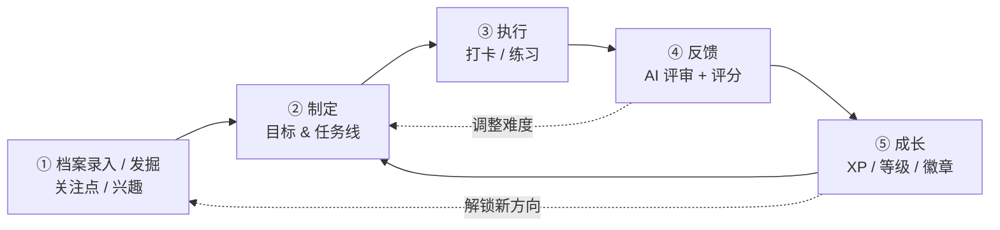

# 2. 核心理念：一个闭环

> 本文档为《项目规划》第 2 节 · [← 返回索引](../项目规划.md)

用户不是来「管理待办」的，而是来「打怪升级」的。产品的核心是一条不断自我强化的循环：

**每个环节的价值：**

| 环节 | 用户痛点 | InnerUp 的解法 |
| --- | --- | --- |
| 发掘 | 「我不知道自己适合/喜欢什么」 | 先**录入个人档案**（文本 / PDF → AI 归类为五类对象，[第 13.9 节](./13-成长地图.md)），再用 AI 对话式引导 + 兴趣测评，产出候选关注点与兴趣 |
| 制定 | 「知道了但不知道从哪开始」 | AI 把大目标拆成可执行的小任务 |
| 执行 | 「坚持不下去」 | 每日任务 + 连续打卡 streak + 番茄计时 |
| 反馈 | 「做了也不知道对不对」 | AI 点评、打分、追问、给下一步建议 |
| 成长 | 「感受不到进步」 | 经验值 / 等级 / 技能雷达图 / 复盘报告 / 成长地图 |

> 设计原则：**任何一个环节都不能让用户面对空白的输入框。** AI 永远给出「下一步的建议」。

> 「成长」具体成长了什么，由[第 13 节 · 成长地图](./13-成长地图.md)定义：关注点 → 兴趣 → 输入 → 知识 → 技能。
