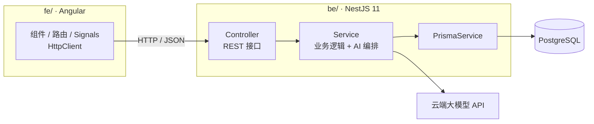

# 5. 技术方案

> 本文档为《项目规划》第 5 节 · [← 返回索引](../项目规划.md)

采用**前后端分离**架构：`fe/` = Angular 前端，`be/` = NestJS 11 后端，两者通过 REST API 通信（接口见[第 6 节 · API 设计](./06-API设计.md)）。

### 5.1 前端（fe/）— Angular

| 层 | 选型 | 说明 |
| --- | --- | --- |
| 框架 | **Angular 20+**（standalone 组件 + Signals） | 官方全家桶，工程化最强，TS 原生 |
| 构建 | **Angular CLI + esbuild** | 内置构建，无需额外配置 |
| 语言 | **TypeScript** | Angular 本身即 TS 优先 |
| 路由 | **Angular Router**（`provideRouter`，懒加载） | 按 feature 懒加载 |
| 状态管理 | **Signals + 服务**（复杂后再上 NgRx SignalStore） | MVP 用 Signals 足够 |
| 请求 | **HttpClient**（`provideHttpClient` + `HttpInterceptorFn`） | 统一 baseURL、loading、错误处理 |
| UI | **Angular Material**（备选 PrimeNG / NG-ZORRO） | 官方组件库，稳定、无障碍完善 |
| 样式 | **SCSS +（可选）Tailwind CSS** | 主题与布局 |
| 图表 | **ngx-echarts** | 技能雷达图、打卡热力图 |
| 表单 | **Reactive Forms** | 与后端 DTO 对齐校验 |

> ⚠️ 注意：**AngularJS（1.x）已于 2022-01 停止维护**。本项目使用**现代 Angular（2+，当前最新为 20+）**，二者 API 完全不兼容。

### 5.2 后端（be/）— NestJS 11

| 层 | 选型 | 说明 |
| --- | --- | --- |
| 框架 | **NestJS 11** | 模块化 + 依赖注入 + 装饰器，工程化强 |
| 语言 | **TypeScript** | 与前端共享类型 |
| 数据库 | **PostgreSQL**（开发 / 生产统一，远端托管：Neon / Supabase / Railway） | 关系型，适合任务树结构；开发期直连远端库，无需本地安装 |
| ORM | **Prisma** | schema 即文档，与 NestJS 集成成熟 |
| DTO 校验 | **class-validator / class-transformer** | 配合全局 `ValidationPipe` |
| AI | **云端大模型 API**（官方 SDK，如 `openai`） | 结构化输出 + SSE 流式返回 |
| AI 结构化 | **Zod** | 约束模型输出，失败可重试 / 降级 |
| 接口文档 | **@nestjs/swagger** | 自动生成 Swagger，前后端联调必备 |
| 认证 | MVP 阶段可**免登录单用户**；需要时再上 `@nestjs/passport` + JWT | 自用阶段别浪费时间 |
| 部署 | 前端静态托管（Nginx / Netlify）+ 后端 Node 进程（Railway / Render / PM2） | 前后端独立部署 |

### 5.3 架构示意

### 5.4 仓库结构

`be/` 与 `fe/` 两个目录**正好对应前后端分离**，保留即可。推荐用 **npm / pnpm workspace** 组织成 monorepo：

- 根目录放 `package.json`（含 `workspaces` 字段）或 `pnpm-workspace.yaml`
- 好处：一条命令同时启动前后端；公共类型可抽到共享包；依赖互相隔离
- 若嫌麻烦，也可以两个独立项目各自 `npm install`，只是需要开两个终端分别启动

**子项目说明文档：** [`fe/README.md`](../../fe/README.md)（Angular 前端）与 [`be/README.md`](../../be/README.md)（NestJS 后端）。

> 说明：前后端分离相比全栈框架多了一层网络请求与联调成本，但边界清晰、前后端可独立部署，更适合你已有的目录结构，也便于后续单独扩展后端。
