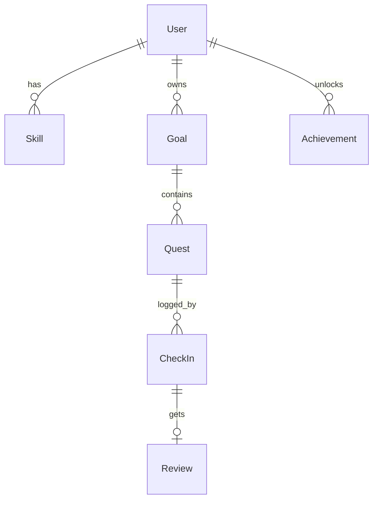

# 7. 数据模型（Prisma 草案）

> 本文档为《项目规划》第 7 节 · [← 返回索引](../项目规划.md)



> 成长地图的四张表（`Focus` / `Interest` / `InputItem` / `Knowledge`，**M2.5 落库**）与 `Skill` 扩展的 ER 见[第 13.7 节](./13-成长地图.md)。

```prisma
model User {
  id           String   @id @default(cuid())
  email        String?  @unique
  name         String?
  level        Int      @default(1)
  xp           Int      @default(0)
  createdAt    DateTime @default(now())

  skills       Skill[]
  goals        Goal[]
  checkIns     CheckIn[]
  achievements Achievement[]
}

model Skill {            // 技能（能做到什么），用于雷达图；兴趣是另一类对象，见第 13 节
  id      String @id @default(cuid())
  userId  String
  name    String          // 编程 / 写作 / 体能 ...
  level   Int    @default(1)
  xp      Int    @default(0)
  color   String?
  user    User   @relation(fields: [userId], references: [id])
}

model Goal {             // 任务线
  id          String   @id @default(cuid())
  userId      String
  title       String            // 学会弹吉他
  description String?
  status      String   @default("active") // active | paused | done
  createdAt   DateTime @default(now())

  user  User    @relation(fields: [userId], references: [id])
  quests Quest[]
}

model Quest {            // 单个任务
  id          String   @id @default(cuid())
  goalId      String
  title       String
  description String?
  difficulty  Int      @default(1)     // 1~5
  xpReward    Int      @default(10)
  estMinutes  Int?
  order       Int      @default(0)
  status      String   @default("todo") // todo | doing | done
  kind        String   @default("practice") // input 输入 | practice 练习 | output 产出
  dueDate     DateTime?

  goal     Goal      @relation(fields: [goalId], references: [id])
  checkIns CheckIn[]
}

model CheckIn {          // 打卡记录
  id          String   @id @default(cuid())
  questId     String
  userId      String
  content     String?              // 文字总结
  evidenceUrl String?              // 图片/链接
  minutes     Int?
  xpEarned    Int      @default(0)
  createdAt   DateTime @default(now())

  quest  Quest   @relation(fields: [questId], references: [id])
  user   User    @relation(fields: [userId], references: [id])
  review Review?
}

model Review {           // AI 评审
  id        String   @id @default(cuid())
  checkInId String   @unique
  score     Int                    // 0~100
  feedback  String                 // AI 反馈正文
  nextHint  String?                // 下一步建议
  createdAt DateTime @default(now())

  checkIn CheckIn @relation(fields: [checkInId], references: [id])
}

model Achievement {
  id         String   @id @default(cuid())
  userId     String
  code       String                 // streak_7 / first_quest ...
  unlockedAt DateTime @default(now())

  user User @relation(fields: [userId], references: [id])
  @@unique([userId, code])
}
```

**等级公式（第一版，简单即可）：**

`升到 N 级所需总经验 = 50 × N × (N − 1) / 2`，即 1→2 需要 50，2→3 需要 150（累计），以此类推。经验来源：完成任务 = `xpReward`，AI 评分高可额外加成。

**streak 计算：** 按 `CheckIn.createdAt` 的日期序列计算连续天数（可用 SQL / 应用层计算，不必单独建表）。

**已落地：** `Quest.kind`（`input` / `practice` / `output`）随 M3 前落地，迁移见 `be/prisma/migrations/20261007063051_add_quest_kind`（理由见[第 13.6 节](./13-成长地图.md)）。

**MVP 内扩展（M2.5，已落地）：** 成长地图的四张新表（`Focus` / `Interest` / `InputItem` / `Knowledge`）与 `Skill.evidence` / `lastPracticedAt` 已随 M2.5 落库，迁移见 `be/prisma/migrations/20261007065315_add_growth_map`；字段定义见[第 13.7 节](./13-成长地图.md)。理由：AI 生成任务线需要档案作为依据（第 13.6 节）。

**MVP 后扩展（M8 / M9）：** `Quest.inputItemId`（任务关联输入素材）与档案的自动维护建议，见[第 13.7 节](./13-成长地图.md)。
