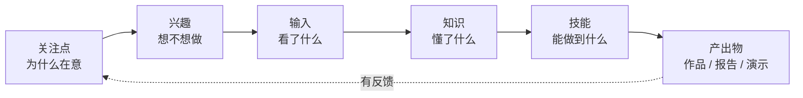
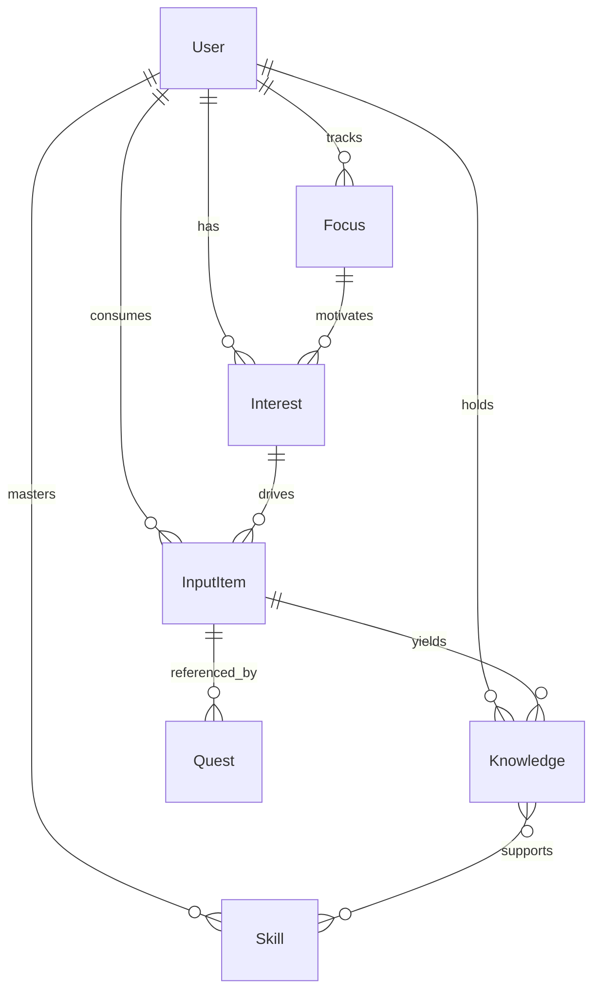

# 13. 成长地图（输入 / 知识 / 技能 / 兴趣 / 关注点）

> 本文档为《项目规划》第 13 节 · [← 返回索引](../项目规划.md)

第 3 节回答了「产品有哪些模块」，但没有回答**「成长」到底成长了什么**——只有一个混装的 `Skill` 表和一张技能雷达图。

本节定义用户档案的五类对象。它们共同组成一张**成长地图**，既是 AI 生成任务线的全部依据，也是「我到底在变强还是在原地打转」的判断标准。

> 状态：**录入部分已在 M2.5 落地**（文本 / PDF → AI 归类 → 用户确认，见 13.9，**排在 M3 之前**）；**看板可视化在 M8**、**自动维护与复盘在 M9**（见 13.8）。`Quest.kind` 已落地（见 13.6）。
>
> **M2.5 实现要点**（与本文档草案的差异）：AI 归类走 `AiModule`（OpenAI 兼容 `/chat/completions` + 原生 JSON 模式 + Zod 二次校验，见[第 8.2 节](./08-AI能力设计.md)）；PDF 文本层抽取用 `pdf-parse`（仅前 60 页，扫描件直接 400 提示粘贴文字）；候选确认接口 `POST /api/map/candidates/apply` 支持部分确认与换类，同批次内按名字自动挂好「兴趣→关注点 / 输入→兴趣 / 知识→输入」关联，同名技能跳过；`PATCH /api/map/:kind/:id` 只接受该 kind 的字段，传错字段直接 400；MVP 免登录，单用户 id 固定为 `local-user`（`CurrentUserService`，接登录时只换这一处）。

---

### 13.1 五类对象

| 维度 | 回答的问题 | 判定标准 | 例子 | 会过期吗 |
| --- | --- | --- | --- | --- |
| **关注点** Focus | 我**为什么**在意 | 当下的处境 / 动机 / 待解决的问题 | 「想转岗做数据」「睡眠差」「在盯 AI Agent」 | 会（几周到几月） |
| **兴趣** Interest | 我**想不想**做 | 好奇方向，可能一直没动手 | 「弹吉他」「潜水」「写小说」 | 会（可能冷却） |
| **输入** Input | 我**看了什么** | 消费过的素材，有来源、有进度、有时间 | 《数据分析实战》第 3 章、某门网课、某期播客 | 不（这是台账） |
| **知识** Knowledge | 我**懂什么** | 能讲清、能解释、能被提问 | 「留存率要按同期群拆开看」 | 不用，但会遗忘 |
| **技能** Skill | 我**能做到什么** | 有产出物、可重复做出、可评级 | 「能独立拉出漏斗查询」「弹唱一首歌」 | 不用，但会退化 |

输入 / 知识 / 技能这三者的边界最容易糊掉，一条硬规则：

> **读完一本书 = 输入；能复述它的结论 = 知识；能用它解决真实问题并留下产出 = 技能。**

这条规则是整张地图的防伪机制，理由见 13.5。

---

### 13.2 它们不是并列清单，是一条链



举例：

「想在工作中做数据驱动决策」（关注点）→ 「对数据分析感兴趣」（兴趣）→ 读《数据分析实战》+ 上网课（输入）→ 理解留存率与同期群的区别（知识）→ 能独立拉出漏斗查询（技能）→ 产出的周报被认可 → 关注点升级为「转岗到数据团队」。

**这条链是 AI 生成任务的判断依据**：检查链条上「哪一段是空的」，就补哪一段。

- 只有输入没有产出 → 该出**产出型**任务，而不是「再读一本书」
- 有兴趣但从没试过 → 该出**试水任务**（第 3.3 节）
- 关注点已经凉了 → 别再做这条线上的任务，先问要不要归档

---

### 13.3 五类对象各自的属性（草案）

**关注点 Focus**

- `title`（想转岗做数据）、`why`（动机，一两句）、`intensity`（1~5 在意程度）、`status`（`active` / `cooling` / `archived`）、`reviewAt`（下次回看时间）
- 来源：用户手动录入，或 AI 从打卡里识别（「你最近三次都在提面试」→ 建议加为关注点）
- **过期机制**：`reviewAt` 到期仍未动 → AI 问「还在意吗」→ 降级为兴趣或归档。不清理，地图就会变成噪音。

**兴趣 Interest**

- `name`、`status`（`curious` 好奇 / `trying` 试水 / `ongoing` 持续 / `cool` 冷却 / `dropped` 放弃）、`triedWhat`（试过什么）
- **兴趣本身不给经验值**，试水之后才给。兴趣的价值是**候选池**：AI 从里面挑下一个目标，用户永远不用面对空白输入框。
- 冷却检测：超过 N 天没动 → 提示「降级为兴趣，还是排一个 15 分钟的最小任务重启？」

**输入 Input（素材台账）**

- `title`、`kind`（`book` / `course` / `article` / `podcast` / `video`）、`source`（作者 / 链接）、`status`（`queued` 想读 / `consuming` 在读 / `finished` 读完 / `dropped` 弃读）、`progress`（第几章 / 百分比）、`minutes`（累计投入）、`takeaway`（一句话收获）
- **必须有消化出口**：每条输入至少要产出一个知识条目或一个产出物，否则标记完成时系统提示「这本书读完了，但没留下任何东西」。
- 输入给经验值，但**明显低于实践与产出**（见 13.6）。

**知识 Knowledge**

- `statement`（一条能被检验的陈述）、`topic`（所属领域）、`confidence`（1~5）、`sourceInputId`（来自哪条输入）
- 生成方式：**AI 抽 + 人确认**。打卡时 AI 从用户的总结里抽候选知识条目，用户点一下确认，而不是手动记笔记。
- 可选的轻量复习：AI 偶尔抽一条旧知识提问，答不上来则 `confidence` 下降（间隔重复的极简版）。

**技能 Skill**

- 沿用第 7 节的 `Skill` 表：`name`、`level`、`xp`、`color`
- 新增 `evidence`（产出物：链接 / 文件 / 打卡 id）与 `lastPracticedAt`
- **升级门槛要挂在产出上**，而不是打卡次数与时长——否则刷时长就能升级，重回「假进步」

---

### 13.4 成长地图怎么被 AI 使用（对应第 8 节）

| 调用点 | 地图的作用 |
| --- | --- |
| **生成任务线** | 带上地图快照 + 近 14 天打卡，判断「缺输入还是缺产出」：只有输入没有产出的链条 → 出产出型任务 |
| **评审打卡** | 除评分外，输出对地图的**更新建议**：`{ skillXp, knowledgeAdded[], inputProgress, interestSignal }`，用户确认后落库 |
| **周报 / 复盘** | 关注点漂移与兴趣冷却检测：「『吉他』三周没动，要降级为兴趣，还是排一个 15 分钟的最小任务？」 |

> **最关键的一条：除首次录入（M2.5）外，地图靠打卡自动长出来，不让用户定期填表。**

任何需要用户定期手动维护的档案都会在两周内荒废。所以：

- 输入进度从打卡里带（「读到第 5 章」）
- 知识条目由 AI 从打卡总结里抽
- 技能经验值由任务完成直接累加
- 用户要手动做的只有三件：**首次一次性录入档案**（13.9）、**新增关注点**、**确认 AI 的更新建议**

---

### 13.5 反模式（明确不做）

| 反模式 | 为什么会死 | 对策 |
| --- | --- | --- |
| 变成 PKM / 笔记工具 | 收藏夹吃灰，投入产出比崩塌 | **不做**富文本编辑器、双向链接、标签体系、导入导出 |
| 把输入当成成长 | 读了 100 本书仍然不会做，假进步最打击人 | 13.1 的硬规则 + 经验值向产出倾斜 |
| 档案要定期手动维护 | 两周后没人维护，地图腐烂 | 录入是一次性的（M2.5，AI 代填 + 用户确认）；之后靠打卡自动长出（M9，13.4） |
| 维度太多太细 | 用户分不清输入 / 知识 / 技能，录入即劝退 | 只保留五类；录入时 AI 代填，用户只做确认 |
| 变成绩效考核表 | 用户开始自我批判，然后卸载 | 地图只呈现投入分布，不做「达标 / 未达标」判定 |

---

### 13.6 与 MVP 的关系（重要）

**档案录入提前到 M3 之前（M2.5）**：AI 生成任务线需要依据——用户先把自己「讲清楚」，M3 / M4 才不会凭空生成。这是本次排期的核心调整，代价约 2 天。

- ✅ **已落地**：`Quest.kind`（`input` / `practice` / `output`），迁移 `20261007063051_add_quest_kind`，见[第 7 节](./07-数据模型.md)。
  一个字段、几乎不增加工作量，但**事后补会让历史数据无法区分**「读书」与「练习」；而「输入与产出交替」正是这张地图唯一的硬要求，数据必须从第一天就分得开。
- ✅ **M2.5 已落地**：`Focus` / `Interest` / `InputItem` / `Knowledge` 四张表 + `Skill.evidence` / `lastPracticedAt`（迁移 `20261007065315_add_growth_map`）、`/api/map/*` 接口（快照 / 文本与 PDF 归类 / 候选确认 / 手动 CRUD / `PATCH|DELETE /:kind/:id`）、`AiModule`（OpenAI 兼容 provider + Zod 校验 + 失败降级）、`/map` 录入与管理页（见 13.7 / 13.8 / 13.9）。
- ✅ **M2.5 起生效**：M4 生成任务线的 prompt 里要求「输入与产出交替」，并带上档案快照，防止 AI 只安排读书类任务。
- ⏸️ **M8 再做**：`/map` 看板视图、雷达图分层、消化率指标。
- ⏸️ **M9 再做**：评审的 `mapUpdates` 建议、周报关注点漂移 / 兴趣冷却检测（档案自动长出）。
- ❌ **不要在 MVP 里做**：富文本编辑器、双向链接、标签体系、导入导出（13.5）。第 3.2 节的技能雷达图保持不变即可。

**经验值倾斜（M5 / M8 生效）：** 产出 ≫ 练习 > 输入。粗略权重 `output = 1.5×`、`practice = 1×`、`input = 0.5×`，具体系数在 M0 手动验证时校准。**M2.5 只负责录入与归类，不结算经验值。**

**推荐里程碑**：M2.5 档案录入 → M3 目标与任务 → M4 生成任务线（带档案快照）→ … → M8 看板 → M9 自动维护。

---

### 13.7 数据模型草案（M2.5 落库）

> 四张新表（`Focus` / `Interest` / `InputItem` / `Knowledge`）与 `Skill` 扩展随 **M2.5** 落库；`Quest.inputItemId` 留到 M8 / M9。落库时索引写法对齐[第 7 节](./07-数据模型.md)（`@@index([userId])` 等）。



```prisma
model Focus {            // 关注点：当下为什么在意
  id        String    @id @default(cuid())
  userId    String
  title     String                  // 想转岗做数据
  why       String?                 // 动机：现在的工作看不到成长
  intensity Int       @default(3)   // 1~5 在意程度
  status    String    @default("active") // active | cooling | archived
  reviewAt  DateTime?               // 到期未动 → AI 询问是否降级
  createdAt DateTime  @default(now())

  user      User       @relation(fields: [userId], references: [id])
  interests Interest[]
}

model Interest {         // 兴趣：想不想做（还不一定会）
  id        String  @id @default(cuid())
  userId    String
  focusId   String?
  name      String                // 弹吉他 / 数据分析
  status    String  @default("curious") // curious | trying | ongoing | cool | dropped
  triedWhat String?               // 试过什么（试水任务记录）
  color     String?
  createdAt DateTime @default(now())

  user   User        @relation(fields: [userId], references: [id])
  focus  Focus?      @relation(fields: [focusId], references: [id])
  inputs InputItem[]
}

model InputItem {        // 输入：看过的素材（台账，不是笔记）
  id         String   @id @default(cuid())
  userId     String
  interestId String?
  title      String                // 《数据分析实战》
  kind       String                // book | course | article | podcast | video
  source     String?               // 作者 / 链接
  status     String   @default("queued") // queued | consuming | finished | dropped
  progress   String?               // 第 3 章 / 45%
  minutes    Int      @default(0)
  takeaway   String?               // 一句话收获（消化出口之一）
  createdAt  DateTime @default(now())

  user      User        @relation(fields: [userId], references: [id])
  interest  Interest?   @relation(fields: [interestId], references: [id])
  knowledge Knowledge[]
  quests    Quest[]
}

model Knowledge {        // 知识：能讲清的东西
  id            String    @id @default(cuid())
  userId        String
  sourceInputId String?
  statement     String               // 留存率要按同期群拆开看
  topic         String?              // 数据分析
  confidence    Int       @default(3) // 1~5
  lastCheckedAt DateTime?
  createdAt     DateTime  @default(now())

  user        User       @relation(fields: [userId], references: [id])
  sourceInput InputItem? @relation(fields: [sourceInputId], references: [id])
  skills      Skill[]
}

// Skill 只列新增字段，其余沿用第 7 节
model Skill {
  evidence        String[]   // 产出物：链接 / 文件 / 打卡 id
  lastPracticedAt DateTime?
  knowledge       Knowledge[]
}

// Quest.kind 已落地（见第 7 节）；M8 / M9 再补下面两列
model Quest {
  inputItemId String?
  inputItem   InputItem? @relation(fields: [inputItemId], references: [id])
}
```

---

### 13.8 接口与页面（M2.5 录入 → M8 看板）

| 阶段 | 方法 | 路径 | 说明 |
| --- | --- | --- | --- |
| M2.5 | `GET` | `/api/map` | 档案快照：五类对象 + 关联关系（一次取全） |
| M2.5 | `POST` | `/api/map/ingest` | **文本录入 → AI 归类**，返回待确认候选（不直接落库） |
| M2.5 | `POST` | `/api/map/ingest/pdf` | **上传 PDF（multipart）→ 抽文本 → AI 归类**，同上 |
| M2.5 | `POST` | `/api/map/candidates/apply` | 确认候选（可编辑 / 部分确认）后落库 |
| M2.5 | `POST` | `/api/map/focus` | 手动新增关注点 |
| M2.5 | `POST` | `/api/map/interest` | 手动新增兴趣（来自发掘对话或手动） |
| M2.5 | `POST` | `/api/map/input` | 手动新增输入素材 |
| M2.5 | `POST` | `/api/map/knowledge` | 手动新增知识条目 |
| M2.5 | `PATCH` | `/api/map/:kind/:id` | 更新状态 / 进度（`kind`: focus / interest / input / knowledge / skill） |
| M2.5 | `DELETE` | `/api/map/:kind/:id` | 删除条目 |
| M8 | `GET` | `/api/map/board` | 看板数据：每类「多久没动」+ 消化率 |
| M9 | `GET` | `/api/map/suggestions` | AI 从近期打卡抽取的待确认更新建议 |
| M9 | `POST` | `/api/map/suggestions/apply` | 一键确认落库 |

页面形态：

- **M2.5 `/map`：录入 + 管理**（详细设计见 13.9）
- **M8 `/map` 看板视图**：五列看板（关注点 → 兴趣 → 输入 → 知识 → 技能），卡片标注「多久没动」并给出下一步建议
- 角色面板（第 3.2 节）不变：等级 / 经验值 / 连续天数 / 技能雷达图；档案是独立页面
- 一个便宜又好用的指标：**消化率 = 有产出的输入 / 总输入**，只做提示，不做评分

---

### 13.9 档案录入页面设计（M2.5）

> 目标：**用户 3 分钟内把自己「讲清楚」**——粘一段文字或传一份 PDF，AI 归类，用户只做确认。页面路由 `/map`。

**页面结构（从上到下）**

1. **录入区**
   - 文本：多行输入框，支持粘贴自我介绍 / 简历 / 笔记（占位提示：「把简历、自我介绍或最近在忙的事粘进来」）
   - PDF：点击或拖拽上传（`accept=".pdf"`，≤10MB）；上传后展示文件名与「已抽取 N 字」
   - 按钮「让 AI 帮我归类」→ `POST /api/map/ingest`（文本）或 `/api/map/ingest/pdf`（文件）
   - **不留空白输入框**（第 2 节原则）：预置 3 个引导问题（「最近一次忘记时间是什么时候？」「你在为什么发愁？」「有什么一直想学没开始的？」），一键填入文本区
2. **待确认区（AI 归类结果）**
   - 按五类分组展示候选卡片，每张可 **改**（编辑字段）/ **删**（不要这条）/ **改类**（输入 ↔ 知识 ↔ 技能 最容易混，见 13.1）
   - 每条带 AI 的 `confidence` 与一句归类依据；低 confidence 高亮「AI 不太确定，帮我确认下」
   - 「全部确认」/「逐条确认」→ `POST /api/map/candidates/apply`
3. **管理区（已落库档案）**
   - 五类分组列表，支持增 / 改 / 删 / 改状态（如输入 `queued → consuming → finished`）
   - 每类展示 13.3 的关键字段；输入类显示进度与「有没有消化出口」提示

**交互与降级**

- AI 失败 / 超时：不阻塞，退回手动录入（五类各一个「＋ 手动新增」）
- **PDF 无文本层（扫描件）**：明确提示「这份 PDF 是扫描件，暂不支持 OCR，请粘贴文字」——MVP 不做 OCR
- 归类结果为空：提示「没识别到可归类的信息，换个写法再试」
- **隐私**：PDF 只在后端内存中解析，默认**不落原始文件**；文本仅入库抽取结果；日志不打印原文

**归类规则（写进 prompt，见[第 8 节](./08-AI能力设计.md)）**

- 硬规则（13.1）：读完 = 输入；能讲清 = 知识；能做出 = 技能
- 分不清的 → 归到「知识」并标低 `confidence`，交给用户改；**不要臆造**，没有的类别返回空数组
- 关注点最多 3 条（避免把档案写成问卷），兴趣每条要短
